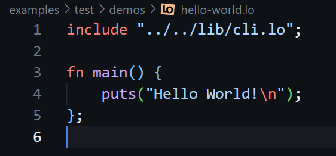
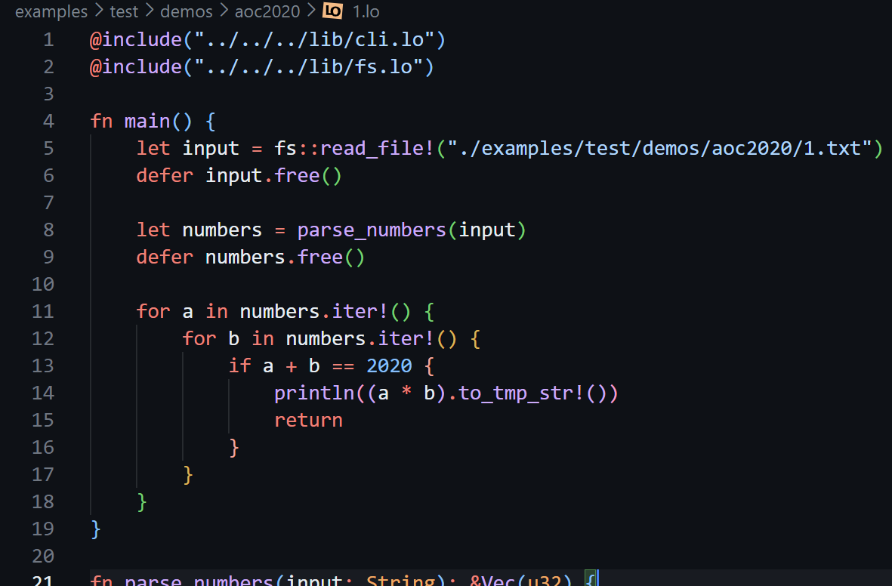
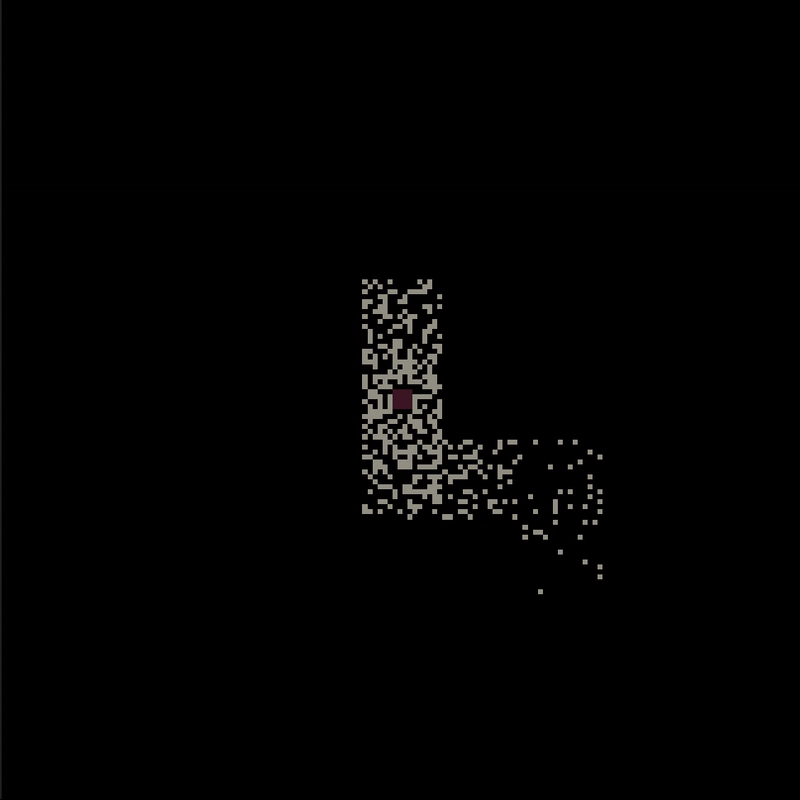

  

LO - small programming language targeting WASM that aims to be as simple as possible

## 🏆 Goals

- Make both the language and the compiler small and easy to understand
- Have little to no dependencies
- Be easy to use and modify
- Emit WASM to have the biggest target coverage with little code

## 🪵 Development Log

🧾 [Parts [0..6] - Building the initial compiler. (text based blog)](https://carrot-blog.deno.dev/?tag=lo)

📺 [Parts [7..] - Building the self-hosted compiler. (YouTube playlist)](https://youtube.com/playlist?list=PL6qyEx0ybzWqkc0zG6jVgRx63nZkdu3DP&si=X8OyuWQ8TNDrfikL)

## 👀 Overview

Check out example `.lo` programs including standard library sources and WIP self-hosted compiler in the [./examples](./examples/) folder.

Here are some of them with syntax highlighting from the [LO VS Code extension](https://marketplace.visualstudio.com/items?itemName=glebbash.lo):

- Hello world [(source)](examples/test/demos/hello-world.lo):

- Advent of Code 2020 Day 1 [(source)](examples/test/demos/hello-world.lo):

- Dark Maze (WASM-4 demo game) [play it here](https://rawcdn.githack.com/glebbash/LO/da8305293f5438967619e91c6ecfd472111ccf91/examples/test/demos/wasm4/builds/dark-maze.html) or check the [source](examples/test/demos/wasm4/src/dark-maze.lo):

## 🚀 Getting started

### Option 1 (recommended): Using VS Code extension only

> This option also works in vscode.dev

- Install the [LO VS Code extension](https://marketplace.visualstudio.com/items?itemName=glebbash.lo)
- To create a new project: Open empty folder, execute Command Palette: `LO: Initialize project in current workspace`
- To run currently open file: execute Command Palette: `LO: Run current file`, or press ▶️ button in the top toolbar
- Compiling files:
  - Open Web Shell: execute Command Palette: `Terminal: Create New Web Shell`
  - Run: `run lo.wasm <input>.lo > <output>.wasm`

### Option 2: Using wasmtime

- Install [wasmtime](https://github.com/bytecodealliance/wasmtime)
- Compiling files: `wasmtime --dir=. lo.wasm <input>.lo > <output>.wasm`
- Getting diagnostics (in json format): `wasmtime --dir=. lo.wasm <input>.lo --inspect`

### Option 3: Using Node.js

- Install [Node.js](https://github.com/bytecodealliance/wasmtime)
- Compiling files: `./utils.mjs compile <input>.lo > <output>.wasm`
- Compiling & running files: `./utils.mjs run <input>.lo`

## 🦀 Building the initial compiler

- Requirements:
  - Install [rustup](https://www.rust-lang.org/tools/install)
  - Install nightly: `rustup toolchain install nightly`
  - Add WASM target: `rustup +nightly target add wasm32-unknown-unknown`
  - You can also find configs for GitHub Codespaces and GitPod in this repo
- Run `./build.sh`

  > This will build the compiler with cargo, putting resulting WASM binary into `lo.wasm`

## 🧪 Running tests

- Requirements:
  - Install [Node.js](https://nodejs.org/en/download/package-manager) for running tests
- Run `./utils.mjs test`

  > This runs tests defined in `utils.mjs`. Test programs are located in `examples/test`
